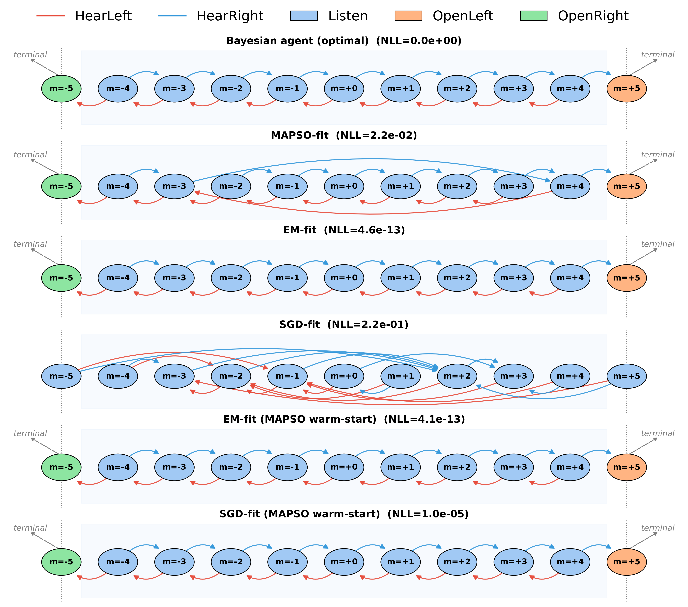
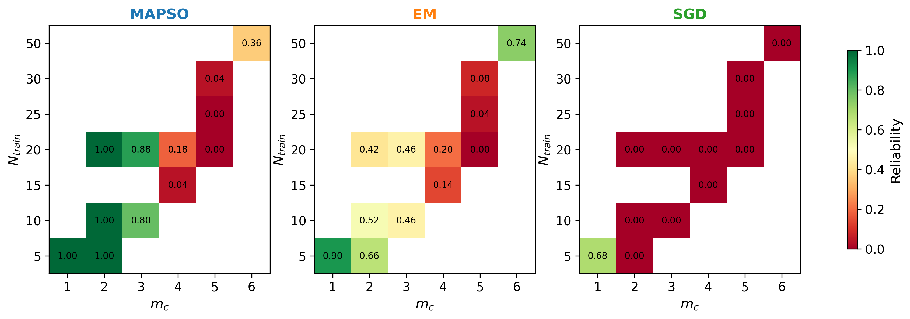

# Tiger POMDP: Learning Finite State Controllers with MAPSO, EM, and SGD

This project implements and benchmarks three optimization methods for learning
**Finite State Controller (FSC)** parameters from trajectory data generated in
the classic **Tiger POMDP** environment. The goal is to estimate FSC
parameters that maximize the likelihood of observed action–observation
sequences — and, more importantly, to test whether doing so well actually
recovers the *correct policy*.

A Finite State Controller is a compact policy representation that maintains a
finite amount of internal memory. Unlike reactive policies that depend only on
the current observation, FSCs use hidden memory states to summarize past
information, making them well-suited to partially observable environments.

## Visualizations

[https://canva.link/ntyixpf0yixi82t](https://canva.link/ri79lyqszonnfqt)

## Methods compared

1. **MAPSO** (Modified Adaptive Particle Swarm Optimization) — a
   population-based global optimizer.
2. **EM** (Expectation-Maximization) — a likelihood-based local optimizer.
3. **SGD** (Stochastic Gradient Descent) — gradient-based local optimization
   via Fisher's identity.

Each method is also evaluated in a **MAPSO-warm-started** variant (EM/SGD
initialized from a MAPSO solution) to test whether combining global search
with local refinement helps.

## Key question

**Does near-zero training NLL imply the learned FSC recovered the correct
policy?**

Low negative log-likelihood (NLL) on the training set is not sufficient evidence
that a method learned the true underlying policy. This project directly tests
policy recovery by replaying each learned model's greedy actions against the
ground-truth Bayesian agent's trajectories, and separately checks
generalization via a held-out validation split (train vs. val NLL).

## What's in the notebook

The main notebook (`Tiger_POMDP.ipynb`) walks through:

1. Ground-truth agent and dataset generation
2. Optimizer hyperparameters
3. Fitting with MAPSO
4. Fitting with EM
5. Fitting with SGD
6. Diagnostics — convergence plots across restarts
7. Warm-started EM (initialized from the MAPSO solution)
8. Warm-started SGD (initialized from the MAPSO solution)
9. Hybrid optimization — policy-match evaluation across MAPSO checkpoints
   (how much MAPSO search is needed before handing off to a local optimizer?)
10. Label-switching alignment and comparison tables (Hungarian algorithm on
    posterior overlap, since FSC node indices are arbitrary up to permutation)
11. FSC visualization
12. Train/val NLL scatter across all trials
13. Persisting results to `results_log.csv`

## Repository structure

```
tiger_pomdp.py    # Tiger POMDP environment + ground-truth agent
mapso.py          # MAPSO implementation
em.py             # EM implementation
sgd.py            # SGD implementation
val.py            # Validation-set generation and evaluation helpers
*.ipynb           # Main experiment notebook
results_log.csv   # Logged trial results (generated)
*_checkpoints/    # Cached .npz results per method, keyed by (mc, n_data, seed)
```

## Requirements

- Python 3.11+
- `numpy`, `scipy`, `matplotlib`, `pandas`, `joblib`
- `numba` (used internally by the MAPSO implementation)

Install with:

```bash
pip install numpy scipy matplotlib pandas joblib numba
```

## Usage

Open the notebook and run cells top to bottom. Fitting cells (MAPSO, EM, SGD,
and their warm-started/hybrid variants) cache results to `.npz`/`.json` files
under `*_checkpoints/` directories, keyed by `(mc, n_data, seed)` — delete the
relevant cache file to force a re-run rather than loading cached results.

Key parameters to adjust at the top of the dataset-generation cell:

- `mc` — target memory complexity of the ground-truth FSC
- `n_data` — training set size (episodes)
- `n_particles`, `n_iterations`, `n_restarts` — shared optimizer budget


## Key Results (Case: mc=5, N=25)

At memory complexity 5 with 25 training trajectories, all methods substantially improve
over the more data-starved mc=5, N=20 setting, and correct policy recovery becomes
achievable — but the path there is uneven.

## Policy graphs



Figure 1: Performance of hybrid optimization and policy alignment. Final Negative Log-Likelihood
(NLL) as a function of the number of MAPSO iterations before handoff to a local optimizer. Handoff
iterations were geometrically sampled, with greater density early in optimization. Each point represents a
warm-start trial in which MAPSO (blue circles) initialized either Expectation-Maximization (EM, orange
squares) or Stochastic Gradient Descent (SGD, green triangles). Filled markers indicate convergence to
the optimal Bayesian policy; open markers indicate a policy mismatch. Markers are slightly offset along
the x-axis (MAPSO: left, EM: center, SGD: right) for clarity.


MAPSO reaches NLL = 2.2×10⁻² and EM reaches a near-machine-precision 4.6×10⁻¹³. Despite MAPSO reaching near-zero NLL, it was not able to recover the Bayesian-optimal policy, only EM. Cold-start SGD fails consistent with its near-zero reliability at mc≥2 across the board.


## Hybrid handoff behavior


Figure 2: Comparison of optimization methods for mc = 5, N=25. Each panel shows the learned policy of each algorithm and the corresponding optimal Bayesian policy (ground truth).


This is where the "lucky" improvements over plain MAPSO show up most clearly. The
MAPSO→EM and MAPSO→SGD traces show that handing off to a local optimizer *before*
MAPSO has fully converged can still land in the correct policy basin — the successful
(filled) handoff points now span a noticeably broader window of iteration counts than
at N=20, where the same trace oscillated erratically between success and failure.

In effect, a partially-converged MAPSO trajectory that hasn't yet locked onto the correct
macro-basin is sometimes rescued by EM or SGD's rapid local convergence, snapping to the
true optimum from an intermediate MAPSO state that, left to run alone, might have drifted
into (or stayed in) a suboptimal basin.


## Restart reliability


Figure 3: Reliability of MAPSO, EM, and SGD in recovering the Bayesian-optimal policy. Values
denote the fraction of 50 restarts that converged to the optimal policy.


MAPSO is reliable for \(m_c \leq 3\) (\(\geq 0.80\)) but drops sharply at \(m_c \geq 4\), reaching 0.00 at \(m_c=5\) for \(N_{\text{train}}\in\{20,25\}\). SGD drops from 0.68 at \(m_c=1\) to 0.00 for all \(m_c\geq2\). EM declines from 0.90 at \(m_c=1\) to 0.00 at \(m_c=5,\ N_{\text{train}}=20\), but recovers to 0.74 at \(m_c=6,\ N_{\text{train}}=50\) with a warm start, suggesting EM benefits strongly from good initialization.
