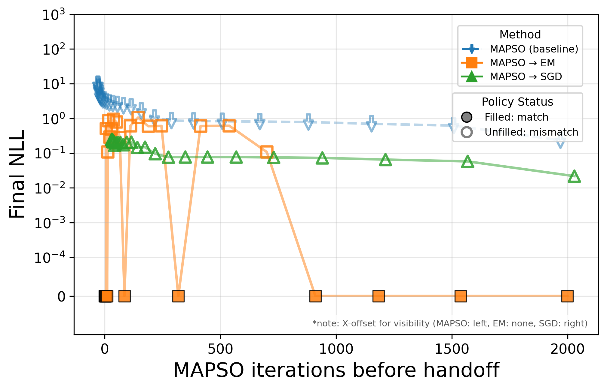
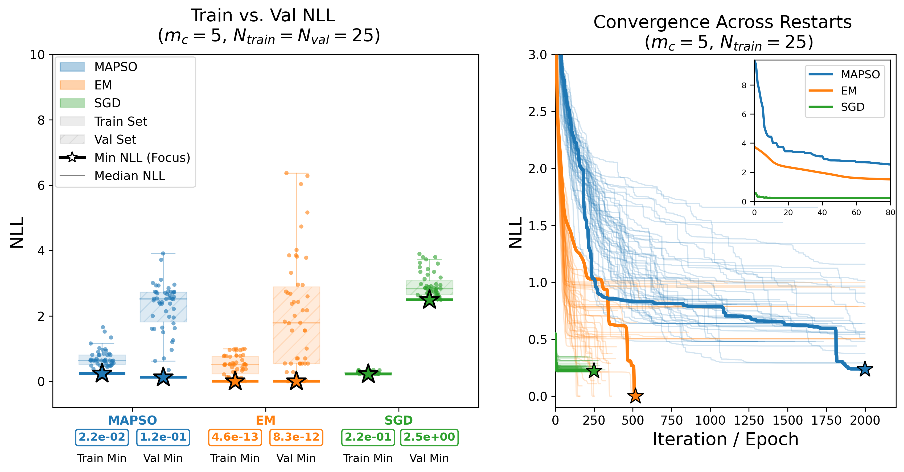

# Tiger POMDP: Learning Finite State Controllers with MAPSO, EM, and SGD

This project implements and benchmarks three optimization methods for learning
**Finite State Controller (FSC)** parameters from trajectory data generated in
the classic **Tiger POMDP** environment. The goal is to estimate FSC
parameters that maximize the likelihood of observed action–observation
sequences — and, more importantly, to test whether doing so well actually
recovers the *correct policy*.

A Finite State Controller is a compact policy representation that maintains a
finite amount of internal memory. Unlike reactive policies that depend only on
the current observation, FSCs use hidden memory states to summarize past
information, making them well-suited to partially observable environments.

## Visualizations

[https://canva.link/ntyixpf0yixi82t](https://canva.link/ri79lyqszonnfqt)

## Methods compared

1. **MAPSO** (Modified Adaptive Particle Swarm Optimization) — a
   population-based global optimizer.
2. **EM** (Expectation-Maximization) — a likelihood-based local optimizer.
3. **SGD** (Stochastic Gradient Descent) — gradient-based local optimization
   via Fisher's identity.

Each method is also evaluated in a **MAPSO-warm-started** variant (EM/SGD
initialized from a MAPSO solution) to test whether combining global search
with local refinement helps.

## Key question

**Does near-zero training NLL imply the learned FSC recovered the correct
policy?**

Low negative log-likelihood on the training set is not sufficient evidence
that a method learned the true underlying policy. This project directly tests
policy recovery by replaying each learned model's greedy actions against the
ground-truth Bayesian agent's trajectories, and separately checks
generalization via a held-out validation split (train vs. val NLL).

## What's in the notebook

The main notebook (`Tiger_POMDP.ipynb`) walks through:

1. Ground-truth agent and dataset generation
2. Optimizer hyperparameters
3. Fitting with MAPSO
4. Fitting with EM
5. Fitting with SGD
6. Diagnostics — convergence plots across restarts
7. Warm-started EM (initialized from the MAPSO solution)
8. Warm-started SGD (initialized from the MAPSO solution)
9. Hybrid optimization — policy-match evaluation across MAPSO checkpoints
   (how much MAPSO search is needed before handing off to a local optimizer?)
10. Label-switching alignment and comparison tables (Hungarian algorithm on
    posterior overlap, since FSC node indices are arbitrary up to permutation)
11. FSC visualization
12. Train/val NLL scatter across all trials
13. Persisting results to `results_log.csv`

## Repository structure

```
tiger_pomdp.py    # Tiger POMDP environment + ground-truth agent
mapso.py          # MAPSO implementation
em.py             # EM implementation
sgd.py            # SGD implementation
val.py            # Validation-set generation and evaluation helpers
*.ipynb           # Main experiment notebook
results_log.csv   # Logged trial results (generated)
*_checkpoints/    # Cached .npz results per method, keyed by (mc, n_data, seed)
```

## Requirements

- Python 3.11+
- `numpy`, `scipy`, `matplotlib`, `pandas`, `joblib`
- `numba` (used internally by the MAPSO implementation)

Install with:

```bash
pip install numpy scipy matplotlib pandas joblib numba
```

## Usage

Open the notebook and run cells top to bottom. Fitting cells (MAPSO, EM, SGD,
and their warm-started/hybrid variants) cache results to `.npz`/`.json` files
under `*_checkpoints/` directories, keyed by `(mc, n_data, seed)` — delete the
relevant cache file to force a re-run rather than loading cached results.

Key parameters to adjust at the top of the dataset-generation cell:

- `mc` — target memory complexity of the ground-truth FSC
- `n_data` — training set size (episodes)
- `n_particles`, `n_iterations`, `n_restarts` — shared optimizer budget


## Key Results

# Case: mc=5, N=25

At memory complexity 5 with 25 training trajectories, all methods substantially improve
over the more data-starved mc=5, N=20 setting, and correct policy recovery becomes
achievable — but the path there is uneven.

## Policy graphs



MAPSO reaches NLL = 2.2×10⁻², EM reaches a near-machine-precision 4.6×10⁻¹³, and both
now recover the correct Bayesian-optimal structure, unlike at N=20 where both had
converged to structurally wrong graphs despite similarly low NLLs. Cold-start SGD still
fails, producing extraneous long-range transition edges (NLL = 2.2×10⁻¹), consistent with
its near-zero reliability at mc≥2 across the board.

## Restart reliability



MAPSO's best-of-50 NLL is 2.20×10⁻² and it now recovers the optimal policy at least some
of the time, though its full-restart reliability from Fig. 5.6 remains at 0.00 for both
N=20 and N=25 — the correct basin exists and is reachable via the single best restart,
but it's still a minority outcome. MAPSO→SGD is essentially fully reliable here
(NLL = 1.01×10⁻⁵), while MAPSO→EM (4.1×10⁻¹³) also succeeds.

## Hybrid handoff behavior


This is where the "lucky" improvements over plain MAPSO show up most clearly. The
MAPSO→EM and MAPSO→SGD traces show that handing off to a local optimizer *before*
MAPSO has fully converged can still land in the correct policy basin — the successful
(filled) handoff points now span a noticeably broader window of iteration counts than
at N=20, where the same trace oscillated erratically between success and failure.

In effect, a partially-converged MAPSO trajectory that hasn't yet locked onto the correct
macro-basin is sometimes rescued by EM or SGD's rapid local convergence, snapping to the
true optimum from an intermediate MAPSO state that, left to run alone, might have drifted
into (or stayed in) a suboptimal basin. This mirrors the paper's broader point about
mc=5, N=25 (Fig. 5.1d): the restart-to-restart instability seen at N=20 — where training/
validation NLL distributions spanned orders of magnitude — narrows substantially at
N=25, and the hybrid pipeline is a direct beneficiary of that narrowing, converting
occasional "lucky" MAPSO trajectories into reliable, correct-policy handoff points more
often than at lower N.

## Takeaway

N=25 sits past the worst of the mc=5 data-starvation regime identified at N=20 (where
every method, including EM at NLL=1.4×10⁻¹¹, failed to recover the true policy). It
isn't yet fully resolved from cold starts alone — full-restart reliability for MAPSO and
EM only fully stabilizes by N=30 — but hybrid MAPSO→local handoff already closes most of
the gap, underscoring the paper's central claim: the benefit of hybridization is less
about early-handoff synergy and more about exploiting whatever fraction of runs happen to
have already crossed into the correct basin, then letting local optimization finish the
job far faster (and here, more reliably) than running MAPSO to full convergence alone.

